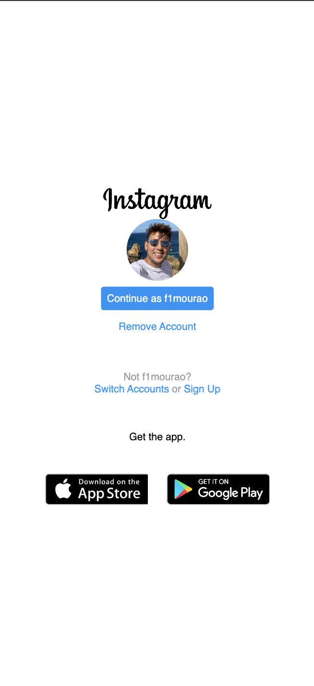

# Projeto de Laboratório Flex Box CSS

## Objetivo
Criar uma versão em Flex Box da Landing Page do Instagram

## Resultado
### Desktop

### Mobile

## Ferramentas Utilizadas
- HTML
- CSS
- Visual Studio Code

## Considerações finais
Foi uma ótima oportunidade para aprender mais sobre o CSS e o Flex Box. Acredito que essas ferramentas requerem bastante prática para que fiquem cada vez mais intuitivas e assim o farei.